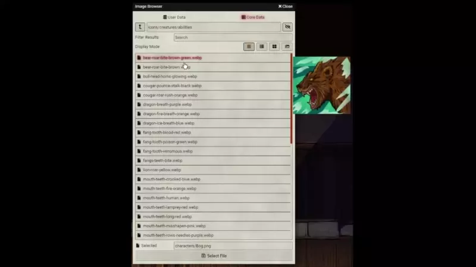

# Image Previewer
> Updated for Foundry v0.9+

A little app to preview images when you hover over them in the file picker menu.

## Installation
1. You can use this link to install in Foundry's Module Manager

    > https://raw.githubusercontent.com/crnormand/image-previewer/release/module.json

## Contribution
If you like our work [Sponsor our development](https://github.com/sponsors/crnormand) or 

Join us on Discord: [GURPS Foundry-VTT Discord](https://discord.gg/6xJBcYWyED)